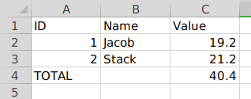

## YF-JAVA-SHARE

Something about java application source to share from [yfsoftcom](https://blog.yunplus.io).

- [简体中文](./README-ZH.md)

### Content

- Export XLSX Report With Dynamic Template & Support Simple Formula.


#### Share1

> Export XLSX Report With Dynamic Template & Support Simple Formula.

- Original Template xlsx

  

- Target 

  

Here, let me explan the key points about the rule.json

```json
[
  {
    "basic": {
      "B2": ["STRING", "n1"],
      "C2": ["NUMERIC", "v1"],
      "B3": ["STRING", "n2"],
      "C3": ["NUMERIC", "v2"]
      
    },
    "formula": {
      "C4": {
        "operate": "SUM",
        "type": "NUMERIC",
        "cells": ["C2", "C3"]
      }
    }
  }
]
```
1) The `basic` node

  It's defines the cells type & absolute position of the xlsx; the 2rd "n1" & "v1" is the Key of the original hashed datas' keys.

2) The `formula` node

  It's defines the cells should be calculate with some simple math procedure; ex: SUM/TIMES, etc.

So that, you can run the spring boot project with command `make bootRun`, then `curl localhost:9001`


than, you got it!

Make a PR or issue is welcome!